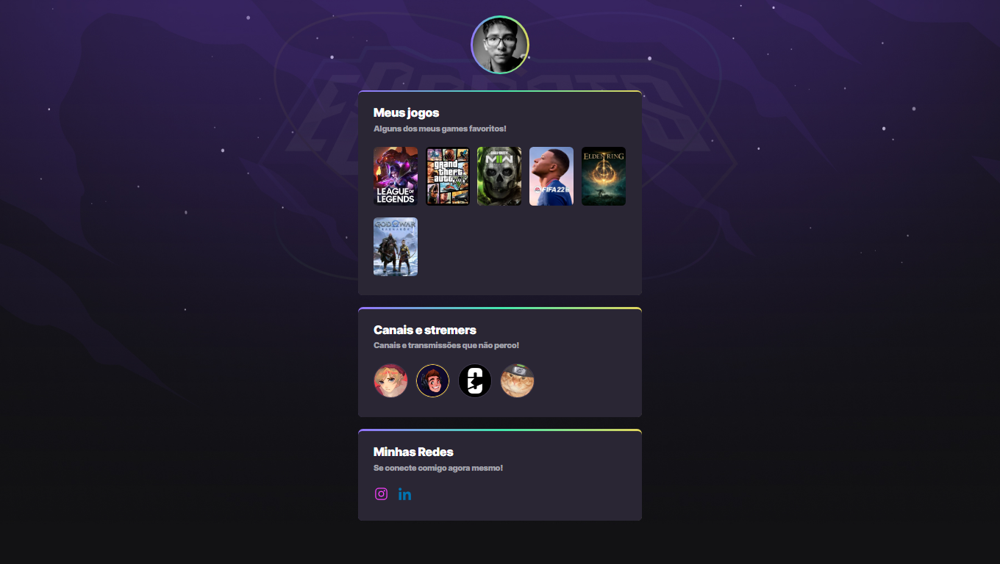

# NLW eSports 
> Trilha Explorer

Projeto realizado durante o evento Next Level Week da Rocketseat

[ 🔗 Clique aqui para acessar](https://rudyfernandes.github.io/nwl-esports/)

## 🚀 Tecnologias

Esse projeto me ajudou a me aprofundar na seguintes tecnologias

- HTML
- CSS
- Git e Github

## 💻 Projeto

Nesta NLW eSports o intuito do projeto era criar um agregador de links dos games e streamers preferidos

# 📧 Contato

rudyfernandez2002@gmail.com
